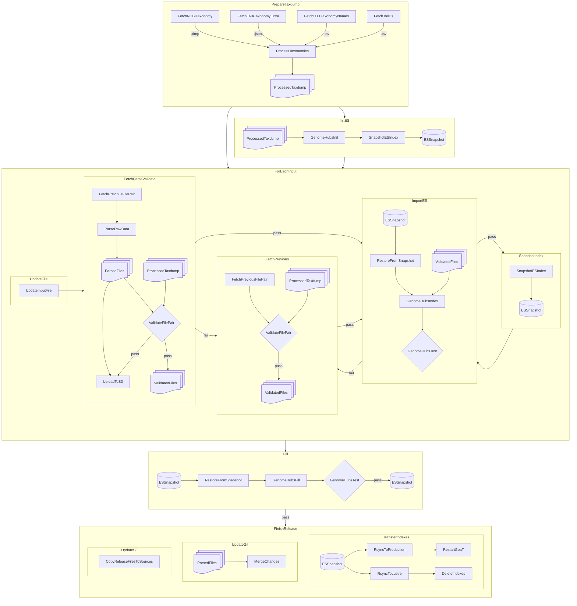

```mermaid
flowchart TB

subgraph PrepareTaxdump
  direction TB
  FetchNCBITaxonomy -->|.dmp| ProcessTaxonomies
  FetchENATaxonomyExtra -->|.jsonl| ProcessTaxonomies
  FetchOTTTaxonomyNames -->|.tsv| ProcessTaxonomies
  FetchTolIDs -->|.tsv| ProcessTaxonomies
  ProcessTaxonomies --> ProcessedTaxdump@{shape: docs}
end

PrepareTaxdump --> ForEachInput

subgraph InitES
  direction LR
  ProcessedTaxdumpInit@{shape: docs, label: "ProcessedTaxdump"} --> GenomeHubsInit
  GenomeHubsInit --> SnapshotESIndex
  SnapshotESIndex --> ESSnapshotInit@{shape: db, label: "ESSnapshot"}
end

PrepareTaxdump --> InitES

subgraph ForEachInput

  direction LR
  subgraph UpdateFile
    UpdateInputFile
  end

  UpdateInputFile --> FetchParseValidate

  subgraph FetchParseValidate
    direction TB
    FetchPreviousFilePair --> ParseRawData
    ParseRawData --> ParsedFiles@{shape: docs}
    ParsedFiles --> UploadToS3
    ParsedFiles --> ValidateFilePair
    ProcessedTaxdumpFPV@{shape: docs, label: "ProcessedTaxdump"} --> ValidateFilePair{ValidateFilePair}
    ValidateFilePair -->|pass| UploadToS3
    ValidateFilePair -->|pass| ValidatedFiles@{shape: docs, label: "ValidatedFiles"}
  end

  subgraph SnapshotIndex
    SnapshotESIndexIndex[SnapshotESIndex]
    SnapshotESIndexIndex --> ESSnapshotIndex@{shape: db, label: "ESSnapshot"}
  end

  FetchParseValidate -->|pass| ImportES
  FetchParseValidate -->|fail| FetchPrevious

  subgraph ImportES
    direction TB
    ESSnapshot@{shape: db} --> RestoreFromSnapshot
    RestoreFromSnapshot --> GenomeHubsIndex
    ValidatedFilesImport@{shape: docs, label: "ValidatedFiles"} --> GenomeHubsIndex
    GenomeHubsIndex --> GenomeHubsTestImport{GenomeHubsTest}
    GenomeHubsTestImport
  end

  ImportES -->|pass| SnapshotIndex
  SnapshotIndex --> ImportES
  ImportES -->|fail| FetchPrevious


  subgraph FetchPrevious
    direction TB
    FetchPreviousFilePair2[FetchPreviousFilePair] --> ValidateFilePair2{ValidateFilePair}
    ProcessedTaxdumpFP@{shape: docs, label: "ProcessedTaxdump"} --> ValidateFilePair2
    ValidateFilePair2 -->|pass| ValidatedFiles2@{shape: docs, label: "ValidatedFiles"}
    ValidatedFiles2
  end

  FetchPrevious -->|pass| ImportES

end

InitES --> ForEachInput

subgraph Fill
  ESSnapshotFillIncoming@{shape: db, label: "ESSnapshot"} --> RestoreFromSnapshotFill[RestoreFromSnapshot]
  RestoreFromSnapshotFill --> GenomeHubsFill
  GenomeHubsFill --> GenomeHubsTestFill{GenomeHubsTest}
  GenomeHubsTestFill -->|pass| ESSnapshotFill@{shape: db, label: "ESSnapshot"}
end

ForEachInput --> Fill

subgraph FinishRelease
  direction TB
  subgraph TransferIndexes
    ESSnapshotProd@{shape: db, label: "ESSnapshot"} --> RsyncToProduction
    RsyncToProduction --> RestartGoaT
    ESSnapshotProd --> RsyncToLustre
    RsyncToLustre --> DeleteIndexes
  end

  subgraph UpdateGit
    ParsedFilesFinish@{shape: docs, label: "ParsedFiles"} -->
    MergeChanges
  end

  subgraph UpdateS3
    CopyReleaseFilesToSources
  end

  
end

Fill -->|pass| FinishRelease

```